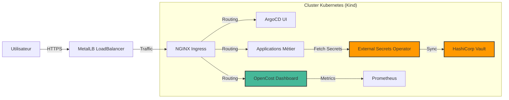
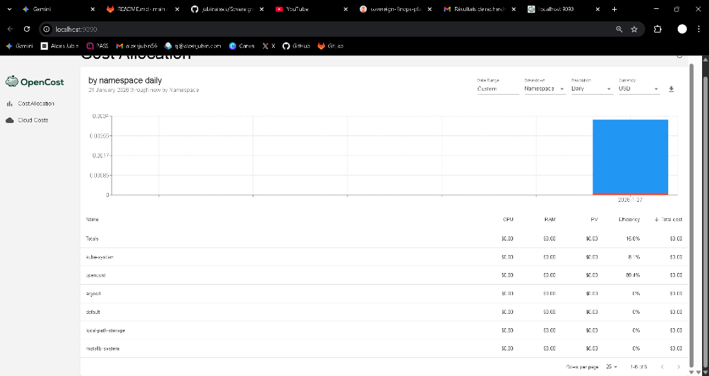
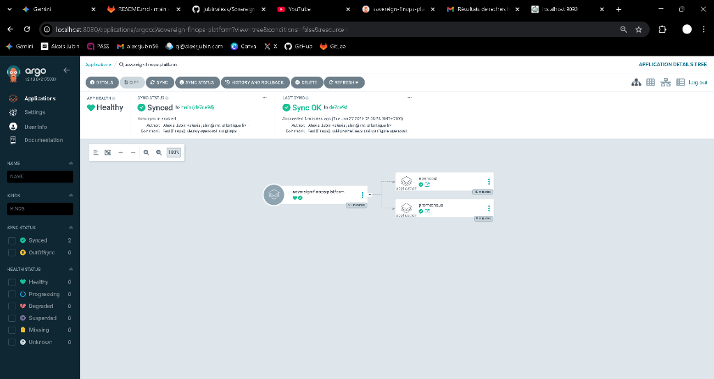

# Sovereign FinOps Platform (Édition Cloud Privé)


## 📌 Résumé Exécutif
Ce projet déploie une **infrastructure Kubernetes de qualité production** en simulant un environnement "Air-Gapped" (souverain), typique des secteurs de la **Défense** ou **Bancaire**.

Il répond à deux impératifs stratégiques :
1.  **Souveraineté Numérique** : Autonomie totale sans dépendance aux Clouds publics (AWS/GKE).
2.  **Excellence FinOps** : Observabilité granulaire des coûts pour chaque microservice.

---

## 🏗️ Architecture Technique

Le flux complet, de l'utilisateur jusqu'à la base de données sécurisée :



### Stack Technologique
*   **Infrastructure** : Docker, Kind, Terraform.
*   **Réseau** : MetalLB (Layer 2), NGINX Ingress.
*   **GitOps** : ArgoCD (Pattern App-of-Apps).
*   **FinOps** : OpenCost, Prometheus.
*   **Sécurité** : HashiCorp Vault, External Secrets Operator.

---

## 📸 La Preuve par l'Image

### 1. FinOps : Monitoring des Coûts en Temps Réel
> Visualisation précise du coût par namespace, permettant une refacturation interne (Chargeback).



### 2. GitOps : Synchronisation Automatisée
> ArgoCD assure que l'état du cluster correspond toujours au code Git (Single Source of Truth).



---

## 🚀 Démarrage Rapide

### Prérequis
*   Docker Desktop
*   Terraform
*   Git

### Installation (Windows / PowerShell)
Lancez simplement ces commandes pour ériger l'infrastructure complète :

```powershell
# 1. Cloner le projet
git clone https://github.com/jubinalexis/Sovereign_Finops_Platform.git
cd sovereign-finops-platform

# 2. Lancer l'infrastructure (via Terraform)
cd infra/terraform
terraform init
terraform apply -auto-approve

# 3. Vérifier que tout est vert !
cd ../..
.\scripts\verify.ps1
```

### Accès aux services
*   **ArgoCD** : `https://localhost:8080` (admin / via script vérif)
*   **OpenCost** : `http://localhost:9090`
*   **Vault** : `http://localhost:8200`