# Architecture - Sovereign FinOps Platform

This document provides detailed architectural diagrams and explanations of the Sovereign FinOps Platform.

## Table of Contents

- [High-Level Architecture](#high-level-architecture)
- [Component Interaction Flow](#component-interaction-flow)
- [Secret Management Flow](#secret-management-flow)
- [Application Dependencies](#application-dependencies)
- [Network Architecture](#network-architecture)
- [GitOps Workflow](#gitops-workflow)

---

## High-Level Architecture

```mermaid
graph TB
    subgraph "User Access Layer"
        User[👤 User/Developer]
        Browser[🌐 Browser]
    end

    subgraph "GitOps Control Plane"
        Git[📦 GitHub Repository]
        ArgoCD[🔄 ArgoCD<br/>GitOps Engine]
    end

    subgraph "Kubernetes Cluster (Kind)"
        subgraph "Security & Policy"
            Kyverno[🛡️ Kyverno<br/>Policy Engine]
            ESO[🔐 External Secrets<br/>Operator]
        end

        subgraph "Secrets Management"
            Vault[🔒 HashiCorp Vault<br/>Secrets Store]
            CSS[📋 ClusterSecretStore]
        end

        subgraph "Monitoring & Cost"
            Prometheus[📊 Prometheus<br/>Metrics]
            OpenCost[💰 OpenCost<br/>Cost Analytics]
        end

        subgraph "Applications"
            Apps[📱 User Applications]
            K8sSecrets[🔑 Kubernetes Secrets]
        end
    end

    subgraph "CI/CD Pipeline"
        GHA[⚙️ GitHub Actions]
        TFLint[🔍 TFLint]
        Trivy[🛡️ Trivy Scanner]
    end

    User -->|Access Dashboards| Browser
    Browser -->|Port-Forward| ArgoCD
    Browser -->|Port-Forward| Vault
    Browser -->|Port-Forward| OpenCost

    User -->|Git Push| Git
    Git -->|Triggers| GHA
    GHA -->|Security Scans| TFLint
    GHA -->|Vulnerability Scan| Trivy

    Git -->|Polls Changes| ArgoCD
    ArgoCD -->|Deploys| Kyverno
    ArgoCD -->|Deploys| ESO
    ArgoCD -->|Deploys| Prometheus
    ArgoCD -->|Deploys| OpenCost
    ArgoCD -->|Deploys| Apps

    Kyverno -->|Enforces Policies| Apps
    ESO -->|Reads Secrets| Vault
    ESO -->|Creates| K8sSecrets
    Apps -->|Uses| K8sSecrets

    Prometheus -->|Scrapes Metrics| Apps
    OpenCost -->|Calculates Costs| Prometheus

    CSS -->|Authenticates with| Vault
    ESO -->|Uses| CSS

    style ArgoCD fill:#326ce5,color:#fff
    style Vault fill:#000,color:#fff
    style Kyverno fill:#5cb85c,color:#fff
    style OpenCost fill:#d9534f,color:#fff
```

### Component Descriptions

| Component | Purpose | Port | Status |
|-----------|---------|------|--------|
| **ArgoCD** | GitOps continuous delivery | 8080 | ✅ Running |
| **Vault** | Secrets management & storage | 8200 | ✅ Running |
| **External Secrets Operator** | Sync secrets from Vault to K8s | - | ✅ Running |
| **Kyverno** | Policy enforcement & validation | - | ✅ Running |
| **Prometheus** | Metrics collection | - | ✅ Running |
| **OpenCost** | Cloud cost monitoring | 9090 | ✅ Running |

---

## Component Interaction Flow

```mermaid
sequenceDiagram
    autonumber
    participant Dev as 👨‍💻 Developer
    participant Git as 📦 Git Repository
    participant ArgoCD as 🔄 ArgoCD
    participant K8s as ☸️ Kubernetes API
    participant Kyverno as 🛡️ Kyverno
    participant App as 📱 Application

    Dev->>Git: 1. Push manifest changes
    Note over Git: apps/myapp/deployment.yaml
    
    ArgoCD->>Git: 2. Poll for changes (3min interval)
    Git-->>ArgoCD: 3. Return updated manifests
    
    ArgoCD->>ArgoCD: 4. Compare desired vs live state
    
    alt Changes Detected
        ArgoCD->>K8s: 5. Apply resources
        K8s->>Kyverno: 6. Admission webhook
        
        alt Policy Validation
            Kyverno->>Kyverno: 7. Check policies
            
            alt Policy Pass
                Kyverno-->>K8s: 8. Allow creation
                K8s->>App: 9. Create/Update pod
                App-->>ArgoCD: 10. Report status
                ArgoCD->>ArgoCD: 11. Mark as Synced/Healthy
            else Policy Fail
                Kyverno-->>K8s: 8. Deny creation
                K8s-->>ArgoCD: 9. Report error
                ArgoCD->>ArgoCD: 10. Mark as Degraded
            end
        end
    else No Changes
        ArgoCD->>ArgoCD: Already in sync
    end
```

---

## Secret Management Flow

### Vault → ESO → Kubernetes Secret Synchronization

### Key Authentication Steps Explained

1. **Vault Kubernetes Auth Setup** (Lines 1-4):
   - Vault is configured to trust the Kubernetes API server
   - CA certificate validates K8s API server identity
   - Token reviewer JWT allows Vault to validate service account tokens

2. **ESO Authentication** (Lines 7-12):
   - ESO runs with a Kubernetes service account (`external-secrets`)
   - ESO retrieves its own JWT token from the pod filesystem
   - Vault receives the JWT and validates it with K8s API
   - If valid, Vault issues a Vault token with `eso-policy` permissions

3. **Secret Synchronization** (Lines 13-17):
   - ESO watches for `ExternalSecret` custom resources
   - For each ExternalSecret, ESO reads the referenced path from Vault
   - ESO creates a native Kubernetes Secret with the data
   - Applications consume the K8s Secret (not Vault directly)

---

## Application Dependencies

### Deployment Order (Sync Waves)

The applications must be deployed in this order to satisfy dependencies:

| Wave | Application | Reason |
|------|-------------|--------|
| 0 | **Vault** | Core secrets storage, no dependencies |
| 1 | **External Secrets Operator** | Depends on Vault being available |
| 1 | **Kyverno** | Independent policy engine |
| 1 | **Prometheus** | Independent metrics collector |
| 2 | **ClusterSecretStore** (vault-config) | Requires both Vault + ESO |
| 2 | **Security Policies** | Requires Kyverno |
| 2 | **OpenCost** | Requires Prometheus |
| 3 | **User Applications** | May require secrets from ESO |

> **Note**: ArgoCD automatically handles dependencies via health checks. Each application waits for its dependencies to be `Healthy` before proceeding.

---

## Network Architecture

```mermaid
graph TB
    subgraph "External Access"
        User[👤 User Browser]
    end

    subgraph "Port Forwards (localhost)"
        PF_ArgoCD[localhost:8080]
        PF_Vault[localhost:8200]
        PF_OpenCost[localhost:9090]
    end

    subgraph "Kubernetes Cluster Network (10.96.0.0/12)"
        subgraph "argocd namespace"
            ArgoCD_SVC[argocd-server<br/>Service]
            ArgoCD_Pod[argocd-server<br/>Pod]
        end

        subgraph "vault namespace"
            Vault_SVC[vault<br/>Service<br/>LoadBalancer]
            Vault_Pod[vault-0<br/>StatefulSet]
        end

        subgraph "opencost namespace"
            OpenCost_SVC[opencost<br/>Service]
            OpenCost_Pod[opencost<br/>Pod]
        end

        subgraph "external-secrets namespace"
            ESO_Pod[external-secrets<br/>Pod]
        end

        subgraph "kyverno namespace"
            Kyverno_Pods[kyverno-*<br/>Pods x7]
        end

        K8s_API[Kubernetes API<br/>443/TCP]
    end

    User -->|HTTP/8080| PF_ArgoCD
    User -->|HTTP/8200| PF_Vault
    User -->|HTTP/9090| PF_OpenCost

    PF_ArgoCD -.->|kubectl port-forward| ArgoCD_SVC
    PF_Vault -.->|kubectl port-forward| Vault_SVC
    PF_OpenCost -.->|kubectl port-forward| OpenCost_SVC

    ArgoCD_SVC -->|ClusterIP| ArgoCD_Pod
    Vault_SVC -->|ClusterIP| Vault_Pod
    OpenCost_SVC -->|ClusterIP| OpenCost_Pod

    ESO_Pod -->|HTTPS/8200| Vault_SVC
    ArgoCD_Pod -->|HTTPS/443| K8s_API
    Kyverno_Pods -->|HTTPS/443| K8s_API

    style Vault_SVC fill:#ffffcc
    style PF_ArgoCD fill:#e6f3ff
    style PF_Vault fill:#e6f3ff
    style PF_OpenCost fill:#e6f3ff
```

### Network Policies (Future Enhancement)

Currently, no NetworkPolicies are enforced. Recommended policies:

- **Vault**: Only allow ingress from ESO pods
- **ArgoCD**: Only allow ingress from port-forward (during dev)
- **Kyverno**: Only allow egress to Kubernetes API
- **Default Deny**: Deny all traffic not explicitly allowed

---

## GitOps Workflow

### GitOps Principles Applied

1. **Declarative Configuration**: All resources defined in Git as YAML
2. **Version Control**: Every change is tracked with Git history
3. **Automated Deployment**: ArgoCD continuously syncs Git → Cluster
4. **Drift Detection**: ArgoCD detects manual changes and alerts
5. **Rollback Capability**: `git revert` to roll back any deployment

---

## Technology Stack Summary

| Layer | Technology | Version | Purpose |
|-------|-----------|---------|---------|
| **Container Orchestration** | Kubernetes (kind) | v1.28+ | Cluster runtime |
| **GitOps** | ArgoCD | v2.9+ | Continuous delivery |
| **Secrets** | HashiCorp Vault | 1.15+ | Secret storage |
| **Secrets Sync** | External Secrets Operator | 0.9+ | K8s secret sync |
| **Policy** | Kyverno | 1.11+ | Policy enforcement |
| **Metrics** | Prometheus | v2.48+ | Metrics collection |
| **Cost** | OpenCost | v1.108+ | Cost analysis |
| **IaC** | Terraform | v1.6+ | Infrastructure provisioning |
| **CI/CD** | GitHub Actions | - | Automated testing |
| **Security Scanning** | Trivy | v0.48+ | Vulnerability scanning |
| **Code Quality** | TFLint | v0.50+ | Terraform linting |

---

## Security Architecture

```mermaid
graph LR
    subgraph "Defense in Depth Layers"
        L1[Layer 1:<br/>CI/CD Security<br/>TFLint, Trivy]
        L2[Layer 2:<br/>Admission Control<br/>Kyverno Policies]
        L3[Layer 3:<br/>Secret Management<br/>Vault + ESO]
        L4[Layer 4:<br/>Network Policies<br/>Future]
        L5[Layer 5:<br/>RBAC<br/>K8s Permissions]
    end

    Code[📝 Code] --> L1
    L1 --> L2
    L2 --> L3
    L3 --> L4
    L4 --> L5
    L5 --> Runtime[🚀 Runtime]

    style L1 fill:#ff9999
    style L2 fill:#ffcc99
    style L3 fill:#ffff99
    style L4 fill:#ccff99
    style L5 fill:#99ccff
```

### Current Security Controls

- ✅ **CI/CD**: Automated scanning before merge
- ✅ **Admission Control**: Kyverno blocks non-compliant pods
- ✅ **Secrets Management**: Vault with Kubernetes auth
- ⚠️ **Network Policies**: Not implemented (enhancement opportunity)
- ⚠️ **RBAC**: Default permissions (enhancement opportunity)

---

## Next Steps

### Recommended Architecture Enhancements

1. **Add sync waves** to ArgoCD applications for explicit ordering
2. **Implement NetworkPolicies** for network segmentation
3. **Configure RBAC** with least-privilege service accounts
4. **Add Grafana** for unified dashboard visualization
5. **Implement Alertmanager** for proactive monitoring

### Performance Considerations

- **ArgoCD Sync Interval**: Currently 3 minutes (configurable)
- **ESO Refresh Interval**: 1 hour (can be reduced for faster secret updates)
- **Prometheus Scrape Interval**: 15 seconds (standard)
- **Kyverno Background Scan**: 1 hour (for existing resources)

---

**Document Version**: 1.0  
**Last Updated**: 2026-01-28  
**Maintainer**: Sovereign FinOps Platform Team
