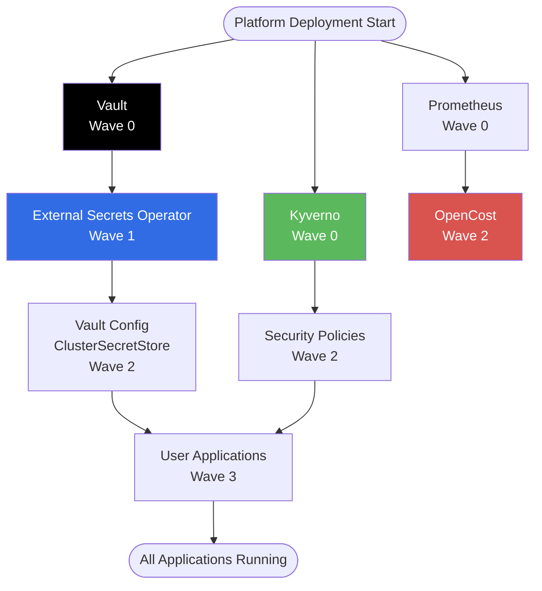

# Application Dependencies Matrix

This document provides a detailed dependency matrix for all applications in the Sovereign FinOps Platform.

## Dependency Graph



## Detailed Dependency Matrix

| Application | Depends On | Reason | Deployment Wave |
|-------------|-----------|--------|-----------------|
| **vault** | None | Standalone secrets storage | 0 |
| **kyverno** | None | Standalone policy engine | 0 |
| **prometheus** | None | Standalone metrics collector | 0 |
| **external-secrets** | Vault (healthy) | Needs Vault API accessible | 1 |
| **vault-config** | Vault + ESO (healthy) | Creates ClusterSecretStore | 2 |
| **security-policies** | Kyverno (healthy) | Deploys ClusterPolicies | 2 |
| **opencost** | Prometheus (healthy) | Queries metrics from Prometheus | 2 |
| **sovereign-finops-platform** | ESO (healthy), Kyverno (healthy) | May use secrets and subject to policies | 3 |

## Runtime Dependencies

### Vault
**Provides**: Secret storage, Kubernetes authentication

**Required By**:
- External Secrets Operator (client)
- ClusterSecretStore (configuration)

**Health Check**: HTTP GET to `http://vault.vault.svc:8200/v1/sys/health`

**Startup Requirements**:
- Unsealed status (auto-unsealed in dev mode)
- Kubernetes auth configured
- Policies created

---

### External Secrets Operator
**Provides**: Kubernetes Secret synchronization from external sources

**Depends On**:
- Vault (must be reachable)

**Required By**:
- Any application using ExternalSecret resources

**Health Check**: Controller pod Ready status

**Startup Requirements**:
- ClusterSecretStore resource created
- Service account with proper RBAC

---

### Kyverno
**Provides**: Admission control, policy enforcement, resource validation

**Depends On**: None (standalone)

**Required By**:
- Security policies (ClusterPolicy resources)

**Health Check**: Admission controller webhook ready

**Startup Requirements**:
- All 3 controllers running:
  - `kyverno-admission-controller`
  - `kyverno-background-controller`
  - `kyverno-cleanup-controller`
  - `kyverno-reports-controller`

---

### Prometheus
**Provides**: Metrics collection and storage

**Depends On**: None (standalone)

**Required By**:
- OpenCost (queries Prometheus API)
- Grafana (future: dashboard visualization)

**Health Check**: HTTP GET to `http://prometheus.prometheus.svc:9090/-/healthy`

**Startup Requirements**:
- Service monitors configured
- RBAC for scraping pods

---

### OpenCost
**Provides**: Cloud cost analysis and allocation

**Depends On**:
- Prometheus (must be queryable)

**Required By**: None (end-consumer)

**Health Check**: HTTP GET to `http://opencost.opencost.svc:9003/healthz`

**Startup Requirements**:
- Prometheus datasource configured
- Node and pod metrics available

---

## Failure Scenarios & Impact

### Vault Fails
**Impact**:
- ❌ ClusterSecretStore status: Invalid
- ❌ ExternalSecrets cannot sync
- ❌ Applications depending on secrets: CrashLoopBackOff
- ✅ Existing Kubernetes Secrets: Still available (cached)
- ✅ Other applications: Continue running

**Recovery**:
1. Fix Vault pod/service
2. Wait for ESO to reconnect (automatic)
3. Restart affected application pods if needed

---

### External Secrets Operator Fails
**Impact**:
- ❌ New ExternalSecrets: Not synced
- ❌ Secret updates: Delayed indefinitely
- ✅ Existing Kubernetes Secrets: Remain valid
- ✅ Applications using existing secrets: Continue running

**Recovery**:
1. Fix ESO deployment
2. ESO automatically syncs on restart

---

### Kyverno Fails
**Impact**:
- ❌ Policy enforcement: Temporarily bypassed
- ⚠️ Non-compliant pods can be created
- ✅ Existing pods: Continue running
- ✅ ArgoCD sync: May succeed with invalid resources

**Recovery**:
1. Fix Kyverno deployment
2. Run background scan to validate existing resources
3. Remediate any policy violations

---

### Prometheus Fails
**Impact**:
- ❌ Metrics collection: Stopped
- ❌ OpenCost: No cost data (relies on metrics)
- ✅ Applications: Continue running (metrics are read-only)

**Recovery**:
1. Fix Prometheus deployment
2. Historical metrics: Lost (unless persistent volume configured)
3. OpenCost resumes cost calculation

---

## Dependency Resolution Strategy

### ArgoCD Sync Strategy

ArgoCD ensures dependencies are met through:

1. **Health Checks**: Waits for dependencies to be `Healthy` before syncing dependents
2. **Sync Waves** (recommended): Explicit ordering via annotations
3. **Retry Logic**: Automatically retries failed syncs

### Recommended Sync Wave Annotations

Add these to Application manifests:

```yaml
# vault.yaml
metadata:
  annotations:
    argocd.argoproj.io/sync-wave: "0"

# external-secrets.yaml
metadata:
  annotations:
    argocd.argoproj.io/sync-wave: "1"

# vault-config.yaml (ClusterSecretStore)
metadata:
  annotations:
    argocd.argoproj.io/sync-wave: "2"

# User applications
metadata:
  annotations:
    argocd.argoproj.io/sync-wave: "3"
```

---

## Circular Dependency Prevention

### Why Kyverno Auto-Sync is Disabled

**Problem**: Kyverno's Helm chart includes a post-upgrade hook that:
1. Runs after main resources are deployed
2. Fails if image cannot be pulled
3. Blocks ArgoCD sync indefinitely

**Solution**: 
- Disabled auto-sync for Kyverno
- Added `SkipHooks=true` to prevent hook execution
- Manual sync required for Kyverno updates

**Trade-off**: Loss of automatic reconciliation, but stability gained

---

## RBAC Dependencies

### Service Account Permissions

| Service Account | Namespace | Permissions | Reason |
|----------------|-----------|-------------|--------|
| `external-secrets` | `external-secrets` | Read secrets, Create secrets | ESO needs to create K8s secrets |
| `vault` | `vault` | None (uses default) | Vault manages its own auth |
| `kyverno` | `kyverno` | Cluster-wide read/write | Admission controller needs to validate all resources |
| `argocd-server` | `argocd` | Cluster-wide read/write | ArgoCD deploys to all namespaces |
| `prometheus` | `prometheus` | Read pods/services | Scraping metrics |

---

## External Dependencies

### GitHub Repository
- **Used By**: ArgoCD (source of truth)
- **Polling Interval**: 3 minutes
- **Impact if unavailable**: No new syncs, but cluster continues running

### Container Registries
- **Docker Hub**: Public images (Vault, Prometheus, etc.)
- **GitHub Container Registry**: Kyverno images
- **Impact if unavailable**: Cannot pull new images, but existing pods continue

### DNS
- **Required For**: Inter-service communication
- **Critical Services**: CoreDNS in kube-system
- **Impact if unavailable**: Service discovery fails, pod-to-pod communication breaks

---

## Monitoring Dependencies

### Recommended Alerts

```yaml
# Alert if Vault is down
- alert: VaultDown
  expr: up{job="vault"} == 0
  for: 1m
  annotations:
    summary: Vault is unavailable
    impact: ESO cannot sync secrets

# Alert if ESO cannot connect to Vault
- alert: ClusterSecretStoreInvalid
  expr: externalsecrets_clustersecretstore_status{status!="Valid"} == 1
  for: 5m
  annotations:
    summary: ClusterSecretStore cannot connect to Vault

# Alert if Kyverno is down
- alert: KyvernoDown
  expr: up{job="kyverno"} == 0
  for: 5m
  annotations:
    summary: Kyverno is down
    impact: Policy enforcement disabled
```

---

**Document Version**: 1.0  
**Last Updated**: 2026-01-28
