# RBAC Security Guide

This document provides guidance on implementing Role-Based Access Control (RBAC) for the Sovereign FinOps Platform.

## Table of Contents

- [Overview](#overview)
- [ArgoCD RBAC](#argocd-rbac)
- [Kubernetes RBAC](#kubernetes-rbac)
- [Service Account Best Practices](#service-account-best-practices)
- [Examples](#examples)

---

## Overview

### Security Principles

1. **Least Privilege**: Grant only the minimum permissions needed
2. **Separation of Duties**: Different roles for different responsibilities
3. **Defense in Depth**: Multiple layers of authorization
4. **Audit Trail**: Track who did what and when

### RBAC Layers in This Platform

```mermaid
graph TD
    User[👤 User] --> SSO[SSO Provider<br/>Google/Okta/LDAP]
    SSO --> ArgoCD[ArgoCD RBAC]
    ArgoCD --> K8s[Kubernetes RBAC]
    K8s --> Vault[Vault Policies]
    
    style User fill:#e1f5ff
    style SSO fill:#fff4e6
    style ArgoCD fill:#e8f5e9
    style K8s fill:#f3e5f5
    style Vault fill:#000,color:#fff
```



---

## ArgoCD RBAC

### Default Roles

ArgoCD provides these default roles:

| Role | Permissions | Use Case |
|------|-------------|----------|
| `role:admin` | Full access | Platform administrators |
| `role:readonly` | Read-only | Auditors, viewers |
| Custom roles | Defined by you | Developers, operators |

### Configuration

RBAC is configured in `argocd-values-prod.yaml`:

```yaml
server:
  rbacConfig:
    # Default: deny all
    policy.default: ""
    
    # Define policies
    policy.csv: |
      # Format: p, <role>, <resource>, <action>, <object>, <effect>
      p, role:admin, *, *, *, allow
```

### RBAC Resources

- `applications` - ArgoCD applications
- `clusters` - Kubernetes clusters
- `repositories` - Git repositories
- `projects` - ArgoCD projects
- `accounts` - User accounts
- `certificates` - TLS certificates
- `gpgkeys` - GPG keys for commit verification

### RBAC Actions

- `get` - View resource
- `create` - Create new resource
- `update` - Modify existing resource
- `delete` - Remove resource
- `sync` - Synchronize application
- `override` - Override sync parameters
- `action/*` - Execute resource actions

---

## Kubernetes RBAC

### Minimum Permissions Required

#### External Secrets Operator

```yaml
apiVersion: v1
kind: ServiceAccount
metadata:
  name: external-secrets
  namespace: external-secrets
---
apiVersion: rbac.authorization.k8s.io/v1
kind: ClusterRole
metadata:
  name: external-secrets-controller
rules:
  # Read ExternalSecret, SecretStore, ClusterSecretStore CRDs
  - apiGroups: ["external-secrets.io"]
    resources:
      - externalsecrets
      - secretstores
      - clustersecretstores
    verbs: ["get", "list", "watch"]
  
  # Update status of ExternalSecrets
  - apiGroups: ["external-secrets.io"]
    resources:
      - externalsecrets/status
      - secretstores/status
      - clustersecretstores/status
    verbs: ["update", "patch"]
  
  # Create and update Kubernetes Secrets
  - apiGroups: [""]
    resources: ["secrets"]
    verbs: ["get", "list", "watch", "create", "update", "patch", "delete"]
  
  # Read ConfigMaps (for configuration)
  - apiGroups: [""]
    resources: ["configmaps"]
    verbs: ["get", "list", "watch"]
  
  # Create events for debugging
  - apiGroups: [""]
    resources: ["events"]
    verbs: ["create", "patch"]
---
apiVersion: rbac.authorization.k8s.io/v1
kind: ClusterRoleBinding
metadata:
  name: external-secrets-controller
roleRef:
  apiGroup: rbac.authorization.k8s.io
  kind: ClusterRole
  name: external-secrets-controller
subjects:
  - kind: ServiceAccount
    name: external-secrets
    namespace: external-secrets
```

#### Kyverno

```yaml
apiVersion: v1
kind: ServiceAccount
metadata:
  name: kyverno
  namespace: kyverno
---
apiVersion: rbac.authorization.k8s.io/v1
kind: ClusterRole
metadata:
  name: kyverno-admission-controller
rules:
  # Read all resources for policy evaluation
  - apiGroups: ["*"]
    resources: ["*"]
    verbs: ["get", "list", "watch"]
  
  # Modify resources for mutation policies
  - apiGroups: ["*"]
    resources: ["*"]
    verbs: ["create", "update", "patch", "delete"]
  
  # Manage policy reports
  - apiGroups: ["wgpolicyk8s.io", "kyverno.io"]
    resources:
      - policyreports
      - policyreports/status
      - clusterpolicyreports
      - clusterpolicyreports/status
    verbs: ["create", "delete", "get", "list", "patch", "update", "watch"]
```

**⚠️ Note**: Kyverno requires broad permissions as an admission controller. Limit its scope by:
- Using namespace selectors in policies
- Excluding system namespaces
- Regular policy audits

---

## Service Account Best Practices

### 1. Namespace Isolation

Create dedicated service accounts per namespace:

```yaml
# Bad: Using default service account
apiVersion: v1
kind: Pod
metadata:
  name: my-app
spec:
  # Uses default SA (has no explicit permissions, but can be risky)
  containers:
    - name: app
      image: myapp:latest

---
# Good: Dedicated service account
apiVersion: v1
kind: ServiceAccount
metadata:
  name: myapp-sa
  namespace: production
---
apiVersion: v1
kind: Pod
metadata:
  name: my-app
  namespace: production
spec:
  serviceAccountName: myapp-sa
  containers:
    - name: app
      image: myapp:latest
```

### 2. Least Privilege Example

```yaml
# Service account for a read-only monitoring app
apiVersion: v1
kind: ServiceAccount
metadata:
  name: metrics-reader
  namespace: monitoring
---
apiVersion: rbac.authorization.k8s.io/v1
kind: Role  # Role (not ClusterRole) - namespace-scoped
metadata:
  name: metrics-reader
  namespace: monitoring
rules:
  # Only read pods and services
  - apiGroups: [""]
    resources: ["pods", "services"]
    verbs: ["get", "list"]
  
  # Only read metrics endpoint
  - apiGroups: [""]
    resources: ["pods/metrics"]
    verbs: ["get"]
---
apiVersion: rbac.authorization.k8s.io/v1
kind: RoleBinding
metadata:
  name: metrics-reader
  namespace: monitoring
roleRef:
  apiGroup: rbac.authorization.k8s.io
  kind: Role
  name: metrics-reader
subjects:
  - kind: ServiceAccount
    name: metrics-reader
    namespace: monitoring
```

### 3. Disable Auto-Mounting (When Not Needed)

```yaml
apiVersion: v1
kind: ServiceAccount
metadata:
  name: no-k8s-access
  namespace: default
# Prevent automatic token mounting
automountServiceAccountToken: false
---
apiVersion: v1
kind: Pod
metadata:
  name: isolated-app
spec:
  serviceAccountName: no-k8s-access
  # Also disable at pod level for extra safety
  automountServiceAccountToken: false
  containers:
    - name: app
      image: myapp:latest
```

Use this for applications that don't need to access the Kubernetes API.

---

## Examples

### Example 1: Developer Role in ArgoCD

**Requirement**: Developers can view all apps, but only sync apps in their project.

```yaml
# argocd-values-prod.yaml
server:
  rbacConfig:
    policy.csv: |
      # Developer role
      p, role:developer, applications, get, */*, allow
      p, role:developer, applications, sync, dev-project/*, allow
      p, role:developer, applications, override, dev-project/*, allow
      p, role:developer, repositories, get, *, allow
      p, role:developer, clusters, get, *, allow
      
      # Map SSO group to role
      g, developers@company.com, role:developer
```

**Testing**:
```bash
# As developer user
argocd app list  # ✅ Works
argocd app sync dev-project/myapp  # ✅ Works
argocd app sync prod-project/myapp  # ❌ Forbidden
```

---

### Example 2: Read-Only Auditor

**Requirement**: Auditors can view everything but cannot make changes.

```yaml
# argocd-values-prod.yaml
server:
  rbacConfig:
    policy.csv: |
      # Auditor role - read-only
      p, role:auditor, applications, get, */*, allow
      p, role:auditor, repositories, get, *, allow
      p, role:auditor, clusters, get, *, allow
      p, role:auditor, projects, get, *, allow
      p, role:auditor, accounts, get, *, allow
      p, role:auditor, certificates, get, *, allow
      
      # Explicitly deny write operations
      p, role:auditor, applications, *, */*, deny
      p, role:auditor, repositories, *, *, deny
      
      # Map SSO group
      g, auditors@company.com, role:auditor
```

---

### Example 3: Application-Specific Service Account

**Requirement**: App needs to read ConfigMaps and Secrets in its own namespace only.

```yaml
apiVersion: v1
kind: ServiceAccount
metadata:
  name: webapp-sa
  namespace: production
---
apiVersion: rbac.authorization.k8s.io/v1
kind: Role
metadata:
  name: webapp-role
  namespace: production
rules:
  # Read ConfigMaps
  - apiGroups: [""]
    resources: ["configmaps"]
    verbs: ["get", "list", "watch"]
    # Optional: restrict to specific ConfigMaps
    resourceNames: ["webapp-config"]
  
  # Read Secrets
  - apiGroups: [""]
    resources: ["secrets"]
    verbs: ["get"]
    resourceNames: ["webapp-db-creds"]
---
apiVersion: rbac.authorization.k8s.io/v1
kind: RoleBinding
metadata :
  name: webapp-binding
  namespace: production
roleRef:
  apiGroup: rbac.authorization.k8s.io
  kind: Role
  name: webapp-role
subjects:
  - kind: ServiceAccount
    name: webapp-sa
    namespace: production
---
apiVersion: apps/v1
kind: Deployment
metadata:
  name: webapp
  namespace: production
spec:
  template:
    spec:
      serviceAccountName: webapp-sa
      containers:
        - name: app
          image: webapp:v1.0
```

---

### Example 4: Creating Non-Admin ArgoCD Users

#### Step 1: Create local user (if not using SSO)

```bash
# Create local user
argocd account update-password \
  --account developer1 \
  --new-password <password>
```

#### Step 2: Define RBAC policy

```yaml
# argocd-values-prod.yaml
configs:
  cm:
    accounts.developer1: login
    accounts.developer1.enabled: "true"

server:
  rbacConfig:
    policy.csv: |
      # Grant developer role to local user
      g, developer1, role:developer
      
      # Developer role definition
      p, role:developer, applications, get, dev-project/*, allow
      p, role:developer, applications, sync, dev-project/*, allow
```

#### Step 3: Test access

```bash
# Login as developer1
argocd login argocd.example.com --username developer1

# Try to sync an app
argocd app sync dev-project/myapp  # ✅ Works
argocd app delete dev-project/myapp  # ❌ Forbidden
```

---

## RBAC Audit Commands

### Check ArgoCD RBAC

```bash
# List all accounts
argocd account list

# Check permissions for a user
argocd account can-i sync applications '*' --as developer1

# View current RBAC policy
argocd settings rbac can developer1 sync applications dev-project/myapp
```

### Check Kubernetes RBAC

```bash
# Check if service account can perform action
kubectl auth can-i create secrets \
  --as=system:serviceaccount:external-secrets:external-secrets

# List all permissions for a service account
kubectl auth can-i --list \
  --as=system:serviceaccount:default:myapp-sa

# View RoleBindings in namespace
kubectl get rolebindings -n production

# View ClusterRoleBindings
kubectl get clusterrolebindings
```

---

## Common RBAC Issues

### Issue 1: Service account lacks permissions

**Symptom**: Pod logs show `forbidden: User "system:serviceaccount:ns:sa" cannot <action>`

**Solution**:
```bash
# Check current permissions
kubectl auth can-i <verb> <resource> --as=system:serviceaccount:<namespace>:<sa-name>

# Create appropriate Role/ClusterRole and Binding
```

### Issue 2: ArgoCD user can't sync applications

**Symptom**: UI shows "permission denied" when clicking Sync

**Solution**:
```bash
# Check user's permissions
argocd account can-i sync applications <project>/<app> --as <username>

# Update RBAC policy in argocd-values-prod.yaml
```

---

## Security Checklist

- [ ] All production service accounts use least-privilege RBAC
- [ ] No service accounts use cluster-admin
- [ ] `automountServiceAccountToken: false` for apps that don't need K8s API
- [ ] ArgoCD RBAC configured with SSO (not local admin)
- [ ] Regular RBAC audits scheduled (quarterly)
- [ ] RBAC changes reviewed in pull requests
- [ ] Documentation updated when RBAC changes

---

**Document Version**: 1.0  
**Last Updated**: 2026-01-28  
**References**:
- [Kubernetes RBAC Documentation](https://kubernetes.io/docs/reference/access-authn-authz/rbac/)
- [ArgoCD RBAC](https://argo-cd.readthedocs.io/en/stable/operator-manual/rbac/)
